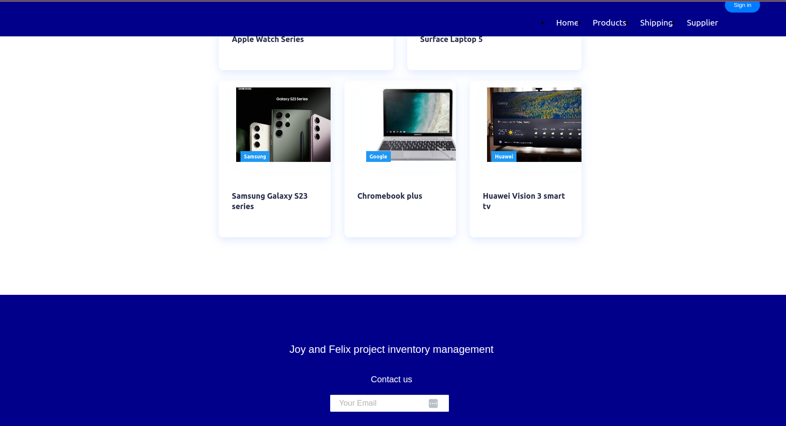
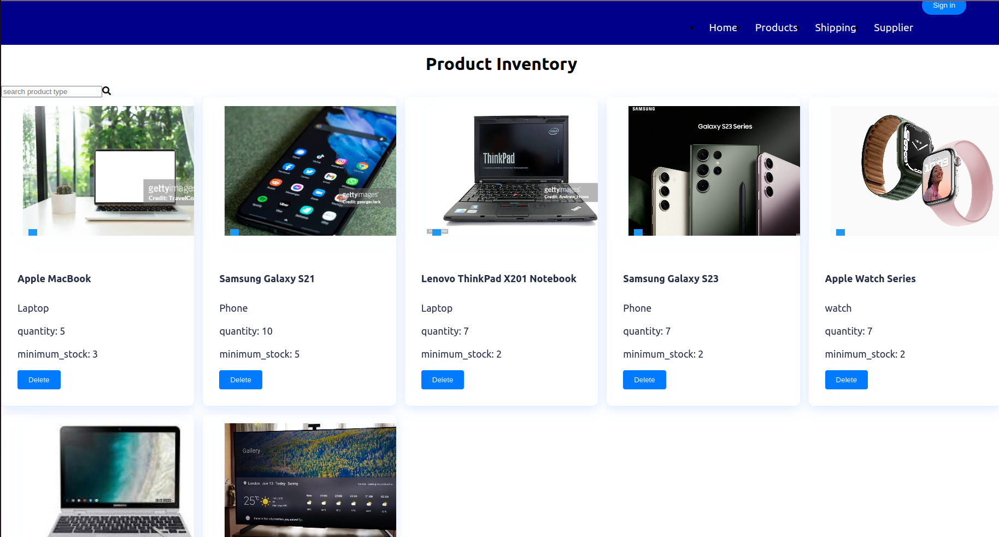
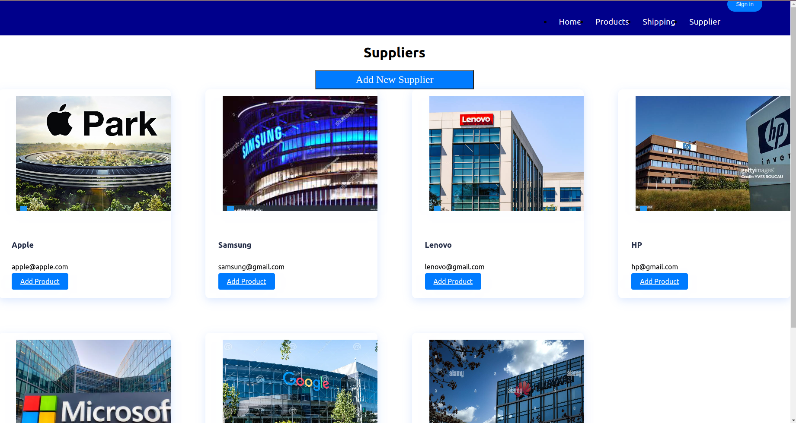
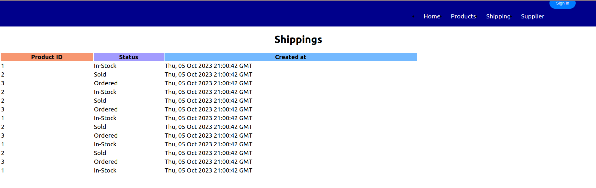

# project-inventory-management-system

## Problem Statement

Electronics are indispensable gadgets that make out lives better. Selling them is a gainful venture that many have tried. However, the challenge of keeping track of your in-store inventory, shipments to customers, suppliers from partners, and real-time information of each gadget requires the support of technology. As developers we saw the need to provide a solution to handle these needs, support easier storage of data, status relays on stock held, ordered and shipped to companies.

## Solution

This project sought to achieve the following:
1. Support users(JFx owners) to add products and delete their existing catalog
2. Track and provide status of shipments of these products across SME supply chain management 
3. Confer CRUD functionality across database information changes in products, suppliers and shipments
4. Integrate and alert feature to notify users on critical aspects of the products, suppliers, and the 5.inventory ecosystem. 
5. Integrate authentication through JWT for safety and application integrity. 

## MVP (Minimum Viable Product)

1. [Landing page](#landingpage)
2. [Supplier page](#supplierpage)
3. [Products page](#productspage)
4. [Incoming page](#incomingpage)

## Technologies Used

### Frontend

- [React.js](https://img.shields.io/badge/react-v18.2.0-blue)
- [React Router](https://img.shields.io/badge/react%20router-v5-blue)

### Backend

### Landing page
This page contains a brief description of the inventory management system. It contains the body and footer which contains the contact details.

### Products page
This page contains a list of products available at the inventory management system. It contains the searchbar feature which enables one to search the product by type.It contains details about each product.Their quantity and minimum stock.One can also delete a product by clicking the delete button

### Supplier Page.
The supplier page contains a list of suppliers for the products.One is able tto add a new supplier and a also add a new product to the supplier

### Incoming Page.
Contans a table which has the id of the product and the status of the product.

## Authors & License

Authored by :
* [Joy Anyango](https://github.com/JOY19ANYANGO).
* [Felix Okeyo](https://github.com/Felix-Okeyo)

Licensed under the [MIT](https://choosealicense.com/licenses/mit/)

